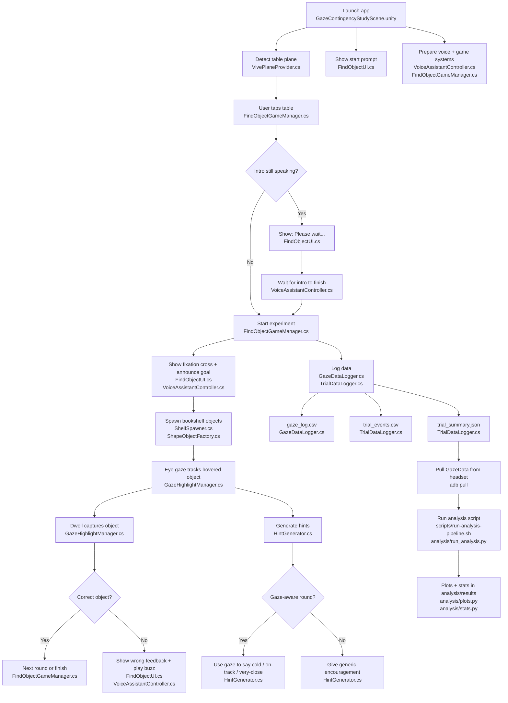

# System Diagram

## Flow Summary

This diagram shows the full runtime and analysis loop for the project.

At a high level, the system does four things:

1. Boots the mixed-reality scene and detects a usable table surface.
2. Waits for the participant to tap the table, then starts the experiment once any spoken intro is finished.
3. Runs repeated search rounds where gaze controls hover, dwell capture, hint generation, and event logging.
4. Saves the run data so it can be pulled from the headset and analyzed locally.

The boxes in the flowchart include the main file that owns each step, so the chart can be used both as a runtime overview and as a code map. In general:

- `FindObjectGameManager.cs` controls experiment state and round progression.
- `ShelfSpawner.cs` builds the bookshelf structure and spawn positions used by each round.
- `ShapeObjectFactory.cs` post-processes spawned prefabs into the actual experimental stimuli.
- `SpawnableObjectInfo.cs` attaches the per-object metadata used throughout the study.
- `FindObjectUI.cs` controls the visible study UI.
- `HintGenerator.cs` controls gaze-aware and gaze-unaware hint behavior.
- `VoiceAssistantController.cs` controls spoken instructions and audio feedback.
- `VoiceSynthesizer.cs` handles TTS generation and playback for spoken prompts.
- `GazeHighlightManager.cs`, `GazeDataLogger.cs`, and `TrialDataLogger.cs` handle gaze interaction and logging.
- The `analysis/` scripts turn exported run data into plots, tables, and statistics.

Repository: [Gaze Contingency Project](https://github.com/PedroPovedaQ/Gaze-Contingency-Project)

