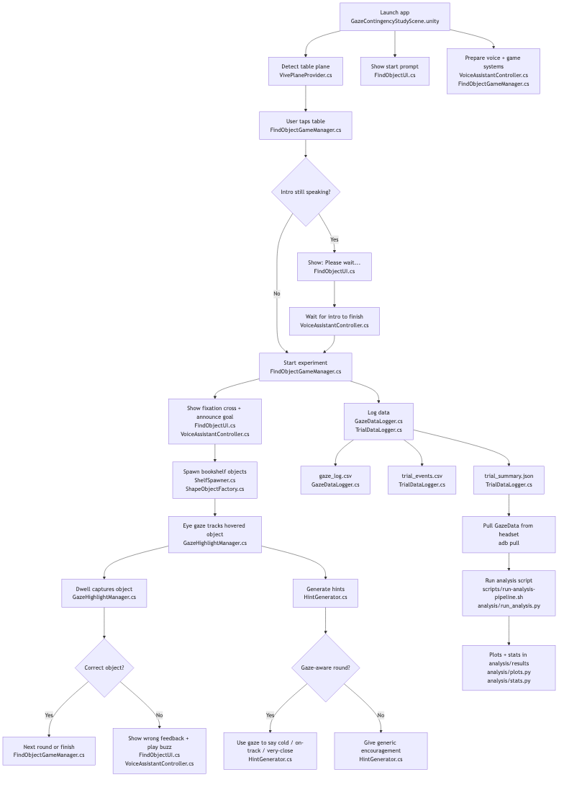

\thispagestyle{empty}
\vspace*{\fill}
\begin{center}
{\LARGE \textbf{Gaze-Contingent AI Assistance in Mixed Reality Object Search Tasks}\par}
\vspace{0.8cm}
{\large Pedro Poveda\par}
{\normalsize CAP 6117\par}
\vspace{0.6cm}
{\normalsize Project Overview\par}
\end{center}
\vspace*{\fill}
\newpage

# Flow Summary

1. **Launch and setup.**
The app opens `GazeContingencyStudyScene.unity`, starts the core experiment systems, and prepares UI plus voice control. `FindObjectGameManager.cs` owns the experiment state machine, `FindObjectUI.cs` owns the visible study HUD, and `VoiceAssistantController.cs` coordinates spoken instructions through `VoiceSynthesizer.cs`.

2. **Plane detection and experiment entry.**
`VivePlaneProvider.cs` detects the usable table plane in mixed reality. The participant sees the start prompt from `FindObjectUI.cs` and taps the table to begin. `FindObjectGameManager.cs` receives that tap and checks whether the intro speech is still playing.

3. **Intro gate and actual experiment start.**
If the spoken introduction is still running, the prompt changes to “Please wait...” and the game waits until `VoiceAssistantController.cs` finishes the intro. Once that gate clears, `FindObjectGameManager.cs` starts the session for real.

4. **Round presentation and object spawning.**
At the start of each round, `FindObjectUI.cs` shows the fixation cross and task UI, while `VoiceAssistantController.cs` announces the current goal. `ShelfSpawner.cs` creates the bookshelf layout and spawn positions. `ShapeObjectFactory.cs` then post-processes spawned prefabs into the actual experimental stimuli, and `SpawnableObjectInfo.cs` attaches the metadata used by gaze logic, capture logic, and analysis.

5. **Gaze interaction and dwell capture.**
During search, `GazeHighlightManager.cs` tracks the currently hovered object and applies dwell-based capture. This is the main bridge between raw gaze interaction and the study task: gaze determines what is being inspected, and sustained dwell converts that inspection into a selection event.

6. **Correct versus wrong selections.**
When dwell capture completes, `FindObjectGameManager.cs` decides whether the selected object matches the current target. Correct selections advance to the next round or finish the study. Wrong selections trigger UI and audio feedback through `FindObjectUI.cs` and `VoiceAssistantController.cs`.

7. **Hint generation.**
`HintGenerator.cs` runs alongside the interaction loop. In gaze-aware rounds, it converts current gaze behavior into temperature-style feedback such as cold, on track, or very close. In gaze-unaware rounds, it gives generic encouragement without using gaze state to personalize the content.

8. **Logging and exported data.**
`GazeDataLogger.cs` writes per-frame gaze data, while `TrialDataLogger.cs` writes event-level logs and per-run summary metrics. Together they produce `gaze_log.csv`, `trial_events.csv`, and `trial_summary.json`, which are the main inputs to downstream analysis.

9. **Pull and analysis workflow.**
After the headset run ends, the `GazeData` folder is pulled with `adb pull`. The analysis workflow starts from `scripts/run-analysis-pipeline.sh` and `analysis/run_analysis.py`, which then call the plotting and statistics modules to produce figures, tables, and reports.

Repository Link: \textcolor{blue}{\uline{\href{https://github.com/PedroPovedaQ/Gaze-Contingency-Project}{Gaze Contingency Project}}}

\newpage

{ width=100% height=88% }
