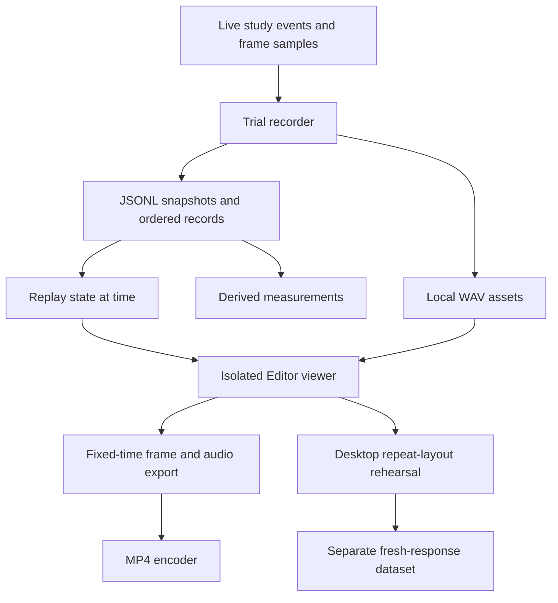
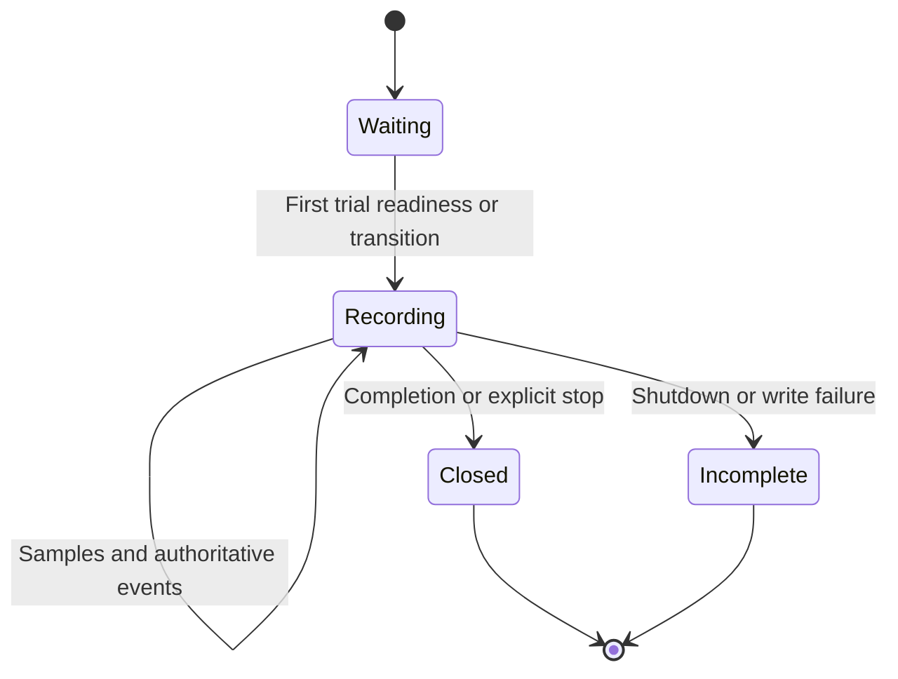
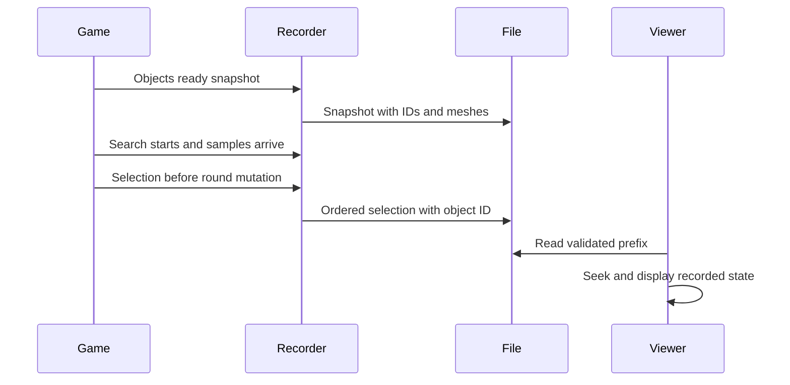

# Trial Recording and Replay - Plan

Tracking: [GitHub issue #28](https://github.com/PedroPovedaQ/Gaze-Contingency-Project/issues/28) · [Gaze Study — Participant Readiness](https://github.com/users/PedroPovedaQ/projects/2). Raw motion requirements remain tracked in [#22](https://github.com/PedroPovedaQ/Gaze-Contingency-Project/issues/22).

## Goal Capsule

Reconstruct individual search trials with their actual object placements, gaze, head movement, selections and audio, so researchers can demonstrate and inspect behavior without repeating the original performance.
Execute locally on the current beta baseline. Preserve existing study behavior and CSV exports. Deliver recording, a desktop Unity viewer, video export, derived measurements, and a separate repeat-layout rehearsal workflow. Hardware validation requires a connected headset and remains an explicit external gate when none is available.

---
## Product Contract

### Summary

Add a versioned, append-only demo recording beside the existing research logs. A separate Unity viewer reads recordings without starting study services, permits seeking and changing viewpoint, and exports deterministic video frames. Analysis recomputes descriptive measurements from recorded evidence. Repeat-layout rehearsal collects fresh choices in a separate dataset with explicit input provenance.

### Problem Frame

The current CSVs identify many gaze and trial events but do not preserve every selected distractor by ID, complete transforms, head poses, or playback assets. Deterministic stimulus generation alone cannot recover original timing or outcomes. Researchers need an inspectable record that does not change when interaction code changes.

### Key Decisions

- Preserve recorded choices instead of rerunning selection logic. Governs R3, R5. (session-settled: user-approved — chosen over deterministic resimulation because timing and later code changes can alter outcomes.)
- Separate playback, derived measurements and fresh responses. Governs R6, R7. (session-settled: user-approved — chosen over pooling replay output with participant observations because replay is not a new human response.)

### Requirements

**Recording**

- R1. Capture trial identity, practice status, layout, target and all object IDs with complete transforms and mesh/color appearance at readiness.
- R2. Record head pose, gaze ray, explicitly available tracking validity, dwell/hover state, search exposure time and changed object transforms at rendered-frame cadence; timestamp using a monotonic session clock and strictly increasing sequence numbers.
- R3. Capture selection ID and correctness before the game mutates round state, and preserve transitions, reveal, pause/resume, stop and audio playback events.
- R4. Retain readable completed records after an interrupted write, clearly mark incomplete recordings and reject incompatible/corrupt data without inventing evidence.

**Playback and reuse**

- R5. Provide trial selection, play/pause, seek, speed control, event jumps, recorded-head and orbit/overhead views with gaze/dwell/selection overlays. Playback must not run study loggers, selection logic or voice providers.
- R6. Export descriptive metrics with source recording identity, analysis version, coverage and limitations. Never label XRI hover segments validated fixations, and never use interpolated visualization samples as new observations.
- R7. Provide an explicitly labeled desktop repeat-layout rehearsal that retains source geometry and target, collects new mouse choices, and writes a unique derived dataset. This is new desktop interaction data, not headset eye-tracking data or a replacement for the participant protocol.
- R8. Export deterministic image frames and an audio mix into a new folder, with a CLI path to encode an MP4; the export must identify synthetic demonstrations and incomplete source coverage.
- R9. Ship a clearly synthetic demo fixture and executable verification so playback can be exercised without a headset. Historical CSVs remain available for analysis but are not misrepresented as complete recordings.

### Assumptions and Scope Boundaries

Implemented baseline: eight surrounding planes, 56 objects per round, two practice trials and 14 measured trials, with shelf layout retained. Verify runtime values from code rather than historical proposal text.
Protocol proposal: repeat-layout rehearsal is a development/research aid outside the measured headset protocol. Desktop input is sufficient for the first fresh-response workflow; changing the live participant protocol or making headset repeat trials a condition needs a separate protocol decision.
Open decision: physical headset recording fidelity and recorder overhead need measurement on connected hardware. No headset is currently connected.
Room passthrough, participant video, voice enrollment recordings and new physiological sensors are outside scope. Archived playback uses saved audio clips; it does not contact TTS services. Raw participant recordings and voice assets stay local and are not committed.

---
## Planning Contract

### Existing Evidence

- `Assets/FindObjectGameManager.cs`: owns trial events, pause-aware clock, object positioning and accepted selections. Correct selection advances state synchronously, so recording must occur before this mutation.
- `Assets/GazeDataLogger.cs`: already stores gaze quaternions, directions, hover ID and dwell; no dedicated head pose or validity columns.
- `Assets/TrialDataLogger.cs`: object manifest stores positions and seated origin; event CSV lacks a dedicated selected-object ID.
- `Assets/VoiceSynthesizer.cs`: emits audio request/ready/playback start/end/cancel/failure and exact text. Playback uses normalized cached clips.
- `Assets/ShapeObjectFactory.cs`: supports six shapes, including procedural meshes. Save mesh geometry so replay survives shape changes.
- `Assets/StudyTrialClock.cs`: search exposure excludes explicit pauses. Preserve that value separately from replay elapsed time.
- `Assets/Editor/GazeWallFilterChecks.cs` and `scripts/test-rotational-layout.sh`: existing Editor and standalone verification patterns.

### Key Technical Decisions

- KTD1. Use a schema-versioned JSON Lines stream in a dedicated `GazeReplays` directory, plus relative WAV assets. Header contains a random recording ID, application version/build GUID, Unity version, coordinate convention and source type. Each record has sequence, elapsed seconds and frame. Append records through a bounded background writer; on overflow or I/O failure disable recording with a visible error and leave existing study behavior intact. Do not silently drop samples and call the recording complete.
- KTD2. Trial snapshots store actual mesh data deduplicated by shape/mesh identity and object transforms relative to a fixed recording origin. Frame records carry current head/gaze poses in that same reference and only changed object transforms. Recording origin stays fixed even if tracking recenters; record the XR origin pose as a separate signal when available. No compression/quantization in the initial format.
- KTD3. A shared pure data model and ordered reducer define playback state. Seeking resolves the trial snapshot plus all state changes through the requested time; pose interpolation, if added, is display-only. Selection events carry ID/correctness and never invoke the live capture handler. (session-settled: user-approved — chosen over resimulation under R3/R5.)
- KTD4. Use an EditorWindow and PreviewRenderUtility for desktop rendering, outside Play mode and the study scene. The same renderer drives frame export. This prevents runtime auto-bootstraps from opening research logs or voice enrollment flows. Use native Editor controls with a clear source/coverage banner.
- KTD5. Capture the normalized AudioClip used by the synthesizer and its actual software playback timestamps. Export PCM WAV once per clip content identity. Playback seeks to recorded clip offset; pause/seek must cancel stale sound, and missing assets show a warning. Audio timing is software onset, not validated acoustic onset.
- KTD6. Reanalysis operates on raw records and authoritative events. Count correct/wrong choices, active search time, sampled hover occupancy, valid/unknown gaze coverage and gaps. Cap interval attribution across missing samples and do not pool practice, measured and rehearsal data. Outputs cannot target the input recording folder.
- KTD7. Desktop rehearsal uses the saved layout and target with its own timer, mouse ray and explicit click selection; it never claims eye gaze/dwell equivalence. Save its source recording/trial, input modality and fresh events in a separate `GazeReplayDerived` folder. Original event choices may be inspected in replay but are not injected into new responses.
- KTD8. Video export renders fixed timestamps independently of wall-clock playback speed, writes a frame manifest and WAV mix, and uses the installed ffmpeg via a separate CLI encoder. Output paths must be new directories; recorder/export failures preserve sources. Source pose steps remain distinguishable from display smoothing.

The mechanism is settled by the existing event architecture; a competing replay engine or physics resimulation would not satisfy authoritative outcome preservation. No bake-off is needed.

### High-Level Technical Design

### Risks and Dependencies

Native Unity import/build requires the installed 6000.3.10f1 editor and package resolution. The checkout has no Library cache yet. Use repository setup helpers and a compatible closed worktree if available.
JSONL frame size and main-thread mesh/audio capture can affect frame time; snapshot once per trial, deduplicate meshes/audio and keep disk I/O off the main thread. Hardware overhead is a rollout gate, not a claimed test result.
Untrusted or incomplete files require bounds, supported schema checks, stable ID checks, finite transforms, safe relative asset paths and prefix recovery restricted to an incomplete trailing record.

---
## Implementation Units

### U1. Recording schema, writer and deterministic replay state

**Requirements:** R1-R5, R9. **Dependencies:** none.
**Files:** `Assets/Replay/TrialReplayData.cs`, `Assets/Replay/TrialReplayFile.cs`, `Assets/Replay/TrialReplayState.cs`, `Assets/Editor/TrialReplayChecks.cs` and corresponding Unity metadata.
**Approach:** Define versioned DTOs, strict read validation, bounded append writer and state reconstruction per KTD1-KTD3. Keep file logic independent of live study components.
**Patterns:** Existing serializable fields and invariant-culture exports.
**Test scenarios:** Round-trip floats and quaternions; repeated shape names with distinct IDs; tied timestamps ordered by sequence; backward/forward seek equals linear application; moved object preserved; malformed middle record rejected; interrupted trailing record retained as incomplete; unsupported schema and unsafe asset paths rejected; writer cannot overwrite existing data.
**Verification:** Editor checks operate on synthetic data in temporary directories and never participant paths.

### U2. Live recorder integration

**Requirements:** R1-R4. **Dependencies:** U1.
**Files:** `Assets/Replay/TrialReplayRecorder.cs`, `Assets/FindObjectGameManager.cs`, `Assets/VoiceSynthesizer.cs`, `Assets/Editor/TrialReplayChecks.cs`.
**Approach:** Explicitly attach recorder to the game manager before trials. Subscribe to lifecycle and voice events, sample after dwell updates, and add one selection hook before game state mutates. Preserve practice identity separately from measured rounds. Close and flush on stop/disable, with a footer only after successful completion.
**Test scenarios:** Correct selection keeps old trial ID when the manager advances; wrong selection continues the trial; pause hides scene without accumulating search; practice does not collide with measured trial IDs; tracking validity unknown does not become valid; shutdown leaves recoverable evidence; write failure does not interrupt the existing game.
**Verification:** Integration fixture drives real recording callbacks and reads the resulting package; Unity compilation and existing layout/voice tests remain green.

### U3. Isolated viewer, rendering and audio

**Requirements:** R5, R9. **Dependencies:** U1.
**Files:** `Assets/Editor/TrialReplayWindow.cs`, `Assets/Editor/TrialReplayRenderer.cs`, `Assets/Editor/TrialReplayChecks.cs`.
**Approach:** Implement native controls and saved-mesh rendering per KTD4/KTD5. Show source type, incomplete state, trial label, timing, selected ID and tracking availability. Draw gaze ray and target/hover/selection overlays. Resolve imported files without changing the active scene.
**Test scenarios:** Open/close releases native resources; paused seek changes scene immediately; rewind clears future selection; missing head data falls back to orbit; missing audio stays visible as a warning; seeking/stopping cancels audio; viewer never creates GazeData files.
**Verification:** Synthetic recording opens and renders nonempty geometry; capture screenshot and inspect controls plus overlays.

### U4. Reanalysis and fresh repeat-layout responses

**Requirements:** R6, R7. **Dependencies:** U1, U3.
**Files:** `scripts/analyze-trial-replay.py`, `scripts/tests/test_trial_replay.py`, `Assets/Editor/TrialReplayWindow.cs`, `Assets/Editor/TrialReplayChecks.cs`.
**Approach:** Implement raw-record metrics and isolated desktop rehearsal per KTD6/KTD7. Keep fresh interaction events and inherited geometry separate from original pose/event streams.
**Test scenarios:** Pauses excluded; wrong and correct selections remain distinct; invalid/unknown gaze and sample gaps reported; practice separated; output cannot overwrite source; rehearsal preserves transforms/target and writes mouse modality without old choices; cancelling records an incomplete attempt.
**Verification:** Python regression suite plus Editor rehearsal checks demonstrate correct provenance and source immutability.

### U5. Demo export, documentation and rollout verification

**Requirements:** R8, R9. **Dependencies:** U2-U4.
**Files:** `Assets/Editor/TrialReplayExport.cs`, `scripts/encode-trial-replay.py`, `scripts/tests/test_trial_replay.py`, `docs/trial-replay.md`, `docs/guide/03-gaze-agent-and-telemetry.md`, `progress.md`.
**Approach:** Add fixed-rate frame export, source-aware audio mix and ffmpeg encoder with path-safe arguments. Provide synthetic fixture generation and batch executeMethod entry points. Document recording pull, playback, reanalysis, rehearsal, video export and limitations.
**Test scenarios:** Frame count/duration match selected range; audio begins at recorded offset and truncates on cancellation; frame export is deterministic after arbitrary viewer seeking; export refuses existing output directory; missing ffmpeg gives an actionable error; incomplete recordings visibly retain their status.
**Verification:** Generate synthetic recording, render a short demo, encode and inspect MP4; run compile and regression gates. Attempt the required Unity Android Build And Run and report the actual device result.

---
## Verification Contract

- New Editor checks: `TrialReplayChecks.Run` through the installed Unity editor, covering serialization, reducer, recorder hooks, rehearsal and renderer resource ownership.
- New Python checks: `python3 -m unittest discover -s scripts/tests -p test_trial_replay.py`.
- Existing regressions: `scripts/test-rotational-layout.sh`, `scripts/test-voice-isolation.sh`, `scripts/test-voice-enrollment.sh`.
- Full project compilation: `scripts/unity-compile-check.sh`, with fresh compile evidence from this checkout.
- Render/export smoke: synthetic input, fixed-rate frames, WAV mix and MP4 metadata plus visual inspection. Synthetic data must remain labeled.
- Required deployment attempt: `scripts/refocus-unity-and-build-device.sh`; do not treat menu dispatch as proof of successful build/install.
- Physical validation: one headset trial containing a wrong choice, correct choice, pause and tracking interruption; compare saved ID/poses/timing and measure frame-time overhead. If no headset is available, report this gate unverified.

---
## Definition of Done

All U1-U5 software capabilities exist and have observed verification results. Plan, usage guide and progress log distinguish implementation from hardware validation and protocol proposals. The generated synthetic demo is inspectable and cannot be mistaken for a participant recording. Original study logs and recordings remain unmodified. No abandoned scaffolding remains. Changes land locally on a feature branch; no merge or production release is requested.

## Execution record — 2026-09-20

U1–U5 software work is implemented on `codex/trial-demo-replay`. Unity Editor checks passed for 56-object snapshots, authoritative wrong/correct capture, backward seeking, object motion, pause visibility, incomplete-tail recovery, corruption/schema/path rejection, source immutability, fresh rehearsal provenance and audio. The integration fixture invokes the real game capture handler before trial advancement. Ten Python analysis/encoder tests passed. Existing layout, voice isolation, enrollment and worktree checks passed.

A final graphics-enabled Unity run rendered 240 frames at 1280×720 and encoded an eight-second H.264/AAC synthetic demo. Derived results report one wrong and one correct choice, five seconds of pause-aware search exposure and 15 explicitly untracked gaze samples. The renderer required installation of Apple's Metal toolchain; a Retina capture cropping issue was corrected and the rendered output visually inspected. This is synthetic evidence, not a recorded headset session.

Sequential inline review covered correctness, source isolation, assembly boundaries, failure handling and test coverage. Review fixes included rejecting complete corrupt records, source-output isolation, preserving unknown tracking validity, recorded search-clock use, resetting fresh rehearsal metadata/timing, bounding image dimensions and throttling scene-component lookup. Hardware fidelity/performance and interactive viewer input remain separate verification limits; automated playback, rendering and rehearsal tests do not substitute for them.

Required Android Build And Run was dispatched. After a cancelled cached preparation pass, retry reached Unity’s “No Android devices connected” dialog. No install is claimed. The viewer loaded visibly via its native menu; coordinate UI automation failed with `noWindowsAvailable`, leaving full interactive input QA open.
