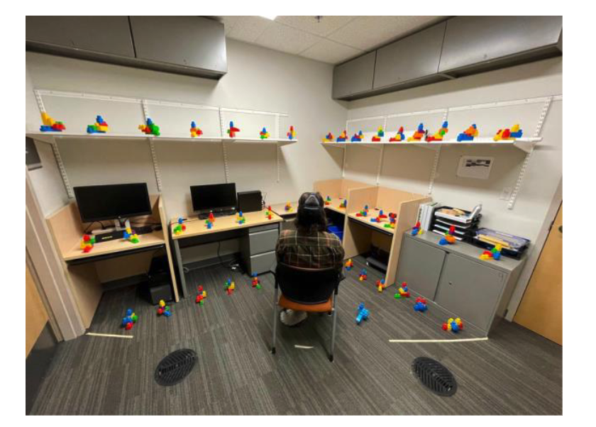

# Rotational AR Search Manuscript Draft

## 3 System Description

### 3.1 Apparatus

The proposed system is a seated mixed reality visual-search environment built in Unity 6 for the HTC Vive Focus Vision standalone headset. The headset is used in video see-through mode so that participants can see the physical room while virtual objects, gaze feedback, and assistant cues are rendered around them. The application targets Android ARM64 and uses OpenXR, XR Interaction Toolkit, the Unity Input System, and HTC's VIVE OpenXR extensions for passthrough and eye tracking.

Participants are seated in a swivel chair placed near the center of the tracked room. The chair defines the task origin. Participants are instructed to remain seated and avoid translational movement, but they may rotate the chair, turn their torso, and move their head naturally. This posture transforms the task from a table-anchored search problem into an egocentric rotational search problem. The participant's body remains fixed in space while relevant objects can appear in front, beside, above, below, or behind them.

Eye gaze is the primary input signal for object targeting, object selection, assistant awareness, and telemetry. The headset's eye-tracking pose is routed through Unity's gaze interaction stack. A tracked pose driver controls the gaze interactor transform, and an `XRGazeInteractor` raycasts from the participant's gaze pose into the scene. The system can optionally render a thin orange gaze ray for debugging or participant feedback, but the visual ray is not required for data collection or gaze-aware assistance. Gaze hover events, dwell selection, head rotation, object coverage, and assistant hint decisions are logged even when the ray is hidden.

The system also records head pose continuously from the headset transform. In the rotational version of the task, head yaw is treated as a core behavioral signal rather than a byproduct of interaction. Head yaw, gaze yaw, target azimuth, target eccentricity from the starting direction, sector transitions, and total angular travel can all be analyzed as part of the participant's search strategy.

The physical arrangement is inspired by seated AR visual-search work such as Warden et al., where the participant sits at the center of a room and searches across a wide egocentric field. Unlike that prior setup, the proposed system uses virtual AR objects for the first implementation so that target identity, distractor distribution, object distance, and object placement can be fully controlled across participants.

### 3.2 Rotational Search Environment

The environment is organized around the participant rather than around a table. At the start of a run, the system establishes a seated origin from the participant's headset position and forward direction. The forward direction is treated as 0 degrees azimuth for that run. Virtual objects are spawned on an invisible cylindrical or spherical shell around the participant, using polar coordinates rather than shelf rows and columns.

Each object placement is defined by four spatial parameters: radius, azimuth, elevation, and sector. Radius determines the object's distance from the participant. Azimuth determines horizontal angle around the participant, with 0 degrees in the forward direction, positive angles to the participant's right, and negative angles to the participant's left. Elevation determines vertical placement relative to seated eye height. Sector groups azimuths into coarse regions such as front, front-right, right, back-right, back, back-left, left, and front-left.

The proposed system uses a 360-degree sectorized search field. Objects are distributed around the participant so that some targets begin in front of the participant while others begin beside or behind the participant. The 360-degree field is divided into angular sectors, allowing the system to measure which regions have been inspected, neglected, or revisited. A 180-degree version can be retained as a debugging fallback, but the study design assumes a full 360-degree search field with sectors.

Objects can be arranged in three vertical bands:

- low objects, near floor or knee height
- middle objects, near seated eye or table height
- high objects, near shelf or upper-wall height

This layout intentionally separates gaze movement from head movement. A participant may inspect nearby objects with small eye movements, but must rotate the head or chair to inspect objects at large azimuthal offsets. This makes it possible to analyze whether gaze-aware assistance reduces inefficient head rotation, improves sector coverage, or helps participants recover from repeatedly inspecting the wrong region.

The system should support two placement modes. In deterministic mode, each round uses a fixed target and distractor layout generated from a seeded challenge set. This is the primary mode for controlled experiments. In adaptive mode, target positions can be selected based on the participant's previous search behavior, such as placing later targets in under-searched sectors. Adaptive placement is useful for follow-up studies but should not be used in the first controlled comparison unless adaptation itself is the independent variable.

### 3.3 Stimuli

The initial stimulus set can preserve the current project's shape-color objects because they provide a controlled and objective conjunction-search task. Each virtual object is defined by one shape and one color. The shape set consists of sphere, cube, pyramid, cylinder, star, and capsule. The color set consists of red, blue, yellow, and purple. Together, these produce 24 possible target categories.

The first rotational version should spawn 32 to 40 objects per round in the 360-degree sectorized field to verify comfort, gaze targeting, and sector coverage. After pilot testing, the density can increase to 48 to 64 objects per round. Object density should be high enough to require search, but not so high that eye tracking becomes unreliable due to overlapping gaze colliders. Objects should be scaled and spaced so that each object can be separately fixated at the chosen radius. A starting radius of approximately 1.5 m is a reasonable first target for mid-height objects, with adjustments made during piloting based on legibility and headset field of view.

In a more creative version of the study, object categories can move beyond abstract shapes. For example, the system can use virtual household items, toy blocks, lab tools, or emergency-response objects. These variants enable semantic search questions such as "find the object you would use to clean a spill," but they introduce recognition and semantic-memory confounds. For the first gaze-contingency comparison, abstract shape-color conjunctions remain preferable because correctness is unambiguous.

Each object receives metadata for shape, color, azimuth, elevation band, sector, radius, and target status. This metadata is used by the gaze logger, trial logger, assistant context builder, and analysis pipeline. It also allows the assistant to distinguish between direct target proximity and broader coverage properties, such as whether the participant has ignored the back-left sector or repeatedly inspected objects of the wrong color.

### 3.4 Gaze-Dwell Selection

Object selection uses the same interaction principle as the current system: sustained gaze dwell. When the participant's gaze ray intersects an object, the object receives an edge highlight. If the participant maintains gaze on that object for the dwell threshold, the object is selected. The current threshold of 1.6 seconds can be retained for the first prototype because it is long enough to avoid most accidental selections but short enough to keep the task moving.

The rotational setup introduces a stronger Midas-touch risk because participants may scan through many objects while rotating. To mitigate this, the system should distinguish between scanning fixations and intentional dwell. A candidate object should only begin charging after a minimum stable-hover interval, and charge should decay quickly if the participant rotates away. The highlight should communicate selection progress clearly without revealing whether the object is the target.

A follow-up version can compare three selection methods:

- gaze dwell only
- gaze dwell followed by controller confirmation
- gaze dwell followed by voice confirmation

This would let the study separate search assistance from selection confidence. However, the first redesigned experiment should preserve gaze dwell so that it remains close to the current project and continues to exercise eye tracking as the primary input signal.

### 3.5 Gaze-Contingent Assistant

The assistant is a spoken guide that provides condition-dependent help during active search. The proposed system supports four assistance configurations created by crossing gaze awareness with voice type. In the gaze-unaware conditions, the assistant gives generic encouragement at fixed or lightly randomized intervals. It does not know where the participant is looking and does not comment on target proximity, object category, or sector coverage. In the gaze-aware conditions, the assistant receives information about the participant's current gaze target, recent fixation history, inspected sectors, uninspected sectors, repeated distractor visits, and approximate target proximity.

Voice type is manipulated independently from gaze awareness. In the neutral-voice conditions, hints are delivered using a standard synthetic or neutral human-like voice. In the self-similar voice conditions, hints are delivered using a participant-like, familiar, or cloned voice. If direct voice cloning is not appropriate for the study protocol, self-similarity can be approximated using a participant-selected preferred voice or a familiar voice profile. The purpose of this manipulation is to test whether a personalized voice changes trust, reliance, comfort, and perceived intrusiveness independently of whether the assistant is actually gaze-aware.

The four assistance configurations are:

- neutral voice, gaze-unaware assistant
- neutral voice, gaze-aware assistant
- self-similar voice, gaze-unaware assistant
- self-similar voice, gaze-aware assistant

This design is intentionally asymmetric in psychological risk. The self-similar gaze-aware condition may feel like the most personal and responsive assistant, but it may also make gaze monitoring more salient and uncomfortable. Therefore, the system should log not only search performance but also trust, reliance, eeriness, voice familiarity, and privacy concern.

The gaze-aware assistant can provide either proximity feedback or coverage feedback.

Proximity feedback is warmer-colder feedback:

- "You are off target right now."
- "You are getting closer."
- "Stay with this area."

Coverage feedback describes the search process rather than the target location:

- "You have not checked much to your left."
- "You have already spent a lot of time in this sector."
- "Try a slower sweep behind you."

The most interesting version combines these two forms but controls their specificity. The assistant should avoid direct target-location statements such as "the target is behind you on the right." Instead, it should use gaze-contingent evidence to nudge the participant toward better search behavior. This preserves the task as a search task while still testing whether gaze awareness provides measurable benefit.

The rotational setup also enables spatialized audio cues. In one variant, spoken hints remain non-spatial, but a soft tone or chime is spatialized toward an unsearched sector or toward the current likely search direction. This condition is useful because prior AR search work suggests audio can support out-of-view target acquisition without adding visual clutter. A later experiment could compare voice-only, spatial audio, visual cue, and combined cue conditions.

### 3.6 Feedback and Telemetry

The telemetry system records three synchronized streams: task events, gaze/head data, and assistant behavior. Task events include round start, target identity, target sector, fixation start, fixation end, wrong selection, correct selection, hint onset, and round completion. Gaze/head data include gaze origin, gaze direction, hovered object, dwell progress, head yaw, gaze yaw, current sector, and whether the target is inside the participant's approximate field of view. Assistant logs include condition, hint timing, hint category, hint text, and the gaze state that triggered the hint.

The rotational study adds several measures that are not meaningful in the shelf version. These include total head-yaw travel per round, angular distance from start orientation to first target fixation, time spent facing each sector, number of sector transitions, revisits to previously inspected sectors, and whether the participant scanned past the target sector before finding it. These measures are important because an assistant may not simply make participants faster; it may make their search path more efficient.

The system should maintain the existing per-frame gaze CSV and trial-summary JSON structure, but add angular fields:

- target azimuth
- target elevation band
- target sector
- current head yaw
- current gaze yaw
- current gaze sector
- cumulative yaw travel
- sector coverage durations
- target in initial field of view

Together, these measurements support a richer analysis of search behavior than time and errors alone.

## 4 Experiment

### 4.1 Task

For this experiment, participants sit in a swivel chair and search for virtual AR objects distributed around them in a 360-degree sectorized search field. Participants are instructed to remain seated throughout the task. They may rotate the chair, turn their torso, and move their head, but they should not stand up or walk around the room. At the beginning of each round, the participant faces a fixed forward direction and views a fixation cross. The target for the upcoming round is displayed and announced by the assistant, for example "Find the blue star."

After the fixation period, the objects for the round appear around the participant. The participant searches the surrounding object field and selects an object by dwelling on it with their gaze. If the selected object matches the target color and shape, the round ends. If the selected object is incorrect, the system gives wrong-object feedback and the participant continues searching.

The task uses the 360-degree sector layout as the primary design. Objects can appear in front of, beside, or behind the participant. This creates genuine out-of-view search and makes rotation behavior central to the study.

Each round contains one target and a controlled set of distractors. Distractors include objects sharing the target color, objects sharing the target shape, and objects sharing neither feature. This keeps the search task objective and prevents participants from relying on a single visual feature.

### 4.2 Study Design

The recommended first study uses a repeated-measures design crossing assistant awareness with voice type. Each participant experiences gaze-unaware and gaze-aware assistance, and each assistance mode is presented in both a neutral voice and a self-similar voice. In gaze-unaware rounds, the assistant gives generic encouragement without access to gaze or sector coverage. In gaze-aware rounds, the assistant uses current gaze, recent fixation history, and sector coverage to provide proximity or coverage feedback. In neutral-voice rounds, the assistant uses a standard synthetic or neutral human-like voice. In self-similar voice rounds, the assistant uses a participant-like, familiar, or cloned voice.

A strong first design is:

- Assistant awareness: gaze-unaware vs gaze-aware
- Voice type: neutral vs self-similar
- Target eccentricity: initially visible vs initially out of view
- Round number: repeated within participant

Assistant awareness is the main task-adaptation factor, and voice type is the main social/personalization factor. Target eccentricity is a within-participant task factor defined by the target's angular distance from the participant's starting forward direction. Initially visible targets appear within the approximate forward field of view. Initially out-of-view targets require head or chair rotation before the participant can inspect them.

The four core conditions are:

- neutral voice, gaze-unaware assistant
- neutral voice, gaze-aware assistant
- self-similar voice, gaze-unaware assistant
- self-similar voice, gaze-aware assistant

For a more creative follow-up, the study can use a 2 x 2 design:

- Assistant awareness: gaze-unaware vs gaze-aware
- Hint style: proximity feedback vs coverage feedback

This would test whether gaze awareness is most useful when the assistant says how close the participant is to the target, or when it comments on the participant's search coverage. A more ambitious version could add cue modality:

- voice-only
- spatial audio
- visual sector cue
- voice plus spatial audio

However, the first experiment should keep the design small enough that gaze behavior and rotation behavior can be interpreted cleanly.

Each participant should complete a balanced set of rounds. A practical structure is 16 rounds: four rounds per core condition. Within each condition, targets should be balanced across sectors and eccentricity classes. For example, each condition can include targets in front, right, back, and left sectors across the full session, or in a finer eight-sector layout if more rounds are available. The target order should be randomized or counterbalanced so that condition is not confounded with learning, fatigue, target sector, or target eccentricity.

The design can also include a multi-target variant inspired by 360-degree VR search tasks. In this variant, a round asks the participant to find all objects matching a criterion, such as all red cylinders or all blue objects, while ignoring distractors. This variant is more demanding than single-target search because participants must maintain a search goal over multiple selections and decide when the relevant objects have all been found. It also makes cueing more meaningful: a gaze-aware assistant can help participants avoid repeatedly revisiting completed sectors or can remind them which sectors remain unsearched. This multi-target version should be treated as a follow-up study unless the single-target version proves too easy.

### 4.3 Measures

Performance - Task performance is measured using time to find the target, wrong selections, first-try accuracy, and time from first target fixation to correct selection. Because each round continues until the target is found, completion time and wrong selections are the main performance measures. Time from first target fixation to selection helps distinguish visual discovery from decision or selection delay.

Rotational search behavior - Rotational behavior is measured using total head-yaw travel, maximum angular displacement from the starting direction, number of sector transitions, time spent facing each sector, and angular distance traveled before first target fixation. These measures are central to the redesigned task. A participant can find the target quickly by using a systematic sweep, or inefficiently by revisiting the same sectors repeatedly. The rotational measures make that difference visible.

Gaze behavior - Gaze behavior is measured using fixation time on the target, fixation time on distractors, fixation count on target and distractors, average fixation duration, number of unique objects inspected, percent of objects inspected before success, and repeated fixations on non-target objects. Gaze coverage is also computed by sector and elevation band. These measures allow the analysis to test whether gaze-aware assistance changes search strategy, not only completion time.

Out-of-view discovery - For each round, the system records whether the target began inside or outside the participant's initial field of view. For out-of-view targets, the system measures time to orient toward the target sector, time to first target fixation, and whether the participant scanned past the target sector before inspecting the target. This is one of the strongest dependent-variable families in the rotational setup.

Cueing and guidance measures - If the study compares cue styles, the system records cue modality, cue direction, cue onset, cue duration, and whether the cue refers to a target, an unsearched sector, or a general search strategy. Candidate cue styles include no cue, spoken generic hint, spoken gaze-aware hint, visual sector cue, gaze line, and spatial audio cue. Cue effectiveness can be measured using time from cue onset to first fixation in the cued sector, time from cue onset to target fixation, and whether the cue caused unnecessary turns away from promising search areas.

Assistant behavior - The system records hint onset time, hint category, hint text, condition, and the gaze/head state that caused the hint. This enables analyses of time from hint to target fixation, time from hint to correct selection, and whether particular hint categories reduce repeated search in already inspected sectors.

Workload and subjective experience - Workload is measured using NASA-TLX after the run or after each block. Additional subjective measures should include perceived helpfulness, trust, annoyance, perceived intrusiveness, perceived physical effort from rotating, preference between assistant conditions, and whether participants noticed that the assistant was gaze-aware.

Voice and personalization measures - The self-similar voice manipulation requires additional subjective measures. Participants should rate voice familiarity, naturalness, similarity to self or familiar voice, comfort, eeriness, privacy concern, and willingness to use the assistant again. The analysis should also measure reliance and compliance behaviorally, for example whether participants follow hints more often in self-similar voice conditions than in neutral voice conditions.

Environmental awareness - A creative addition is to measure what participants remember about the surrounding environment. After a subset of rounds, participants can answer questions about non-target objects, object sectors, or incidental physical-room events. This tests whether assistance improves target search while narrowing awareness, a tradeoff reported in wide-area AR navigation-aid work.

### 4.4 Research Question and Hypotheses

The primary research question is:

> How does gaze-contingent assistant feedback affect performance, visual attention, rotational search behavior, and workload during seated AR object search?

The following hypotheses are proposed:

H1: Participants will find targets faster in gaze-aware rounds than in gaze-unaware rounds.

H2: Participants will make fewer wrong selections in gaze-aware rounds than in gaze-unaware rounds.

H3: Gaze-aware assistance will reduce inefficient rotation, reflected by lower total head-yaw travel and fewer repeated visits to previously inspected sectors.

H4: Gaze-aware assistance will improve sector coverage efficiency, reflected by faster inspection of unsearched sectors and fewer repeated fixations on distractors in already-searched sectors.

H5: The benefit of gaze-aware assistance will be larger for initially out-of-view targets than for initially visible targets.

H6: Self-similar voice will increase perceived familiarity, social presence, and compliance with assistant hints relative to neutral voice.

H7: Self-similar voice will increase privacy concern and eeriness, especially when paired with gaze-aware assistance.

H8: Coverage feedback will produce more systematic search behavior than simple proximity feedback, whereas proximity feedback may produce faster target captures once participants are near the target.

H9: Gaze-aware assistance will reduce mental demand when it is perceived as useful, but may increase annoyance or perceived intrusiveness when participants feel that the system is over-monitoring their gaze.

The expected pattern is not simply that gaze-aware assistance makes every round faster. In some cases, a gaze-aware assistant may slow participants slightly by encouraging a more systematic sweep. The stronger claim is that gaze-aware assistance should improve search efficiency, reduce redundant inspection, and help participants recover from missed or neglected sectors, especially when the target is not initially visible.

The voice manipulation may produce a different kind of effect. Self-similar voice may not directly improve search time, but it may increase trust, compliance, engagement, and perceived social presence. The key risk is over-reliance or discomfort: participants may follow a self-similar assistant more readily even when its feedback is vague, and they may perceive a self-similar gaze-aware assistant as more invasive than a neutral gaze-aware assistant.

### 4.5 Participants

Participants should be adults with normal or corrected-to-normal vision who can safely use an immersive headset and rotate in a chair. Because the study depends on color-shape discrimination and eye tracking, participants should be screened for color-vision issues, eye-tracking calibration quality, and comfort with seated rotation. Participants should not have neck, back, vestibular, or motion-sickness concerns that would make repeated head or chair rotation unsafe.

The final manuscript should report the number of recruited participants, exclusions, age range, gender distribution, vision correction status, prior XR experience, color-vision screening, and eye-tracking calibration failures. Any participant excluded for poor gaze calibration, excessive missing gaze data, simulator discomfort, or incomplete rounds should be reported before analysis.

### 4.6 Procedure

Upon arrival, participants complete consent and demographic questionnaires. The experimenter explains that the participant will search for virtual objects while seated in a swivel chair and that they should rotate rather than stand or walk. The experimenter also explains that selection is performed by sustained gaze, and participants are shown how the dwell highlight charges before selection.

The participant dons the headset and completes eye-tracking calibration. The experimenter then positions the participant in the chair and aligns the participant to the forward reference direction. Before the main task, participants complete several practice rounds with targets and distractors not used in the experiment. Practice rounds should include at least one front target and one side or rear target so that participants experience both gaze dwell and rotational search.

After practice, the main task begins. At the start of each round, the participant faces the forward reference and views a fixation cross with the target instruction. The assistant announces the target. After a short transition interval and blank pause, objects appear around the participant. The participant searches by looking and rotating, then selects an object by gaze dwell. The assistant provides hints according to the current condition. Correct selections advance to the next round, and wrong selections produce feedback while the round continues.

After the final round, participants complete NASA-TLX and any additional subjective questionnaires. A short debriefing interview should ask which hints were helpful, whether the participant noticed gaze-aware behavior, whether the assistant felt intrusive, and what search strategy they used. If environmental awareness is included, recall questions should be asked before explaining the study hypotheses.

The full session should include setup and consent, headset fitting, eye-tracking calibration, practice, the main 360-degree sectorized search task, workload and subjective questionnaires, and debriefing. The exact duration will depend on the number of rounds, object density, and whether the study includes single-target rounds only or a later multi-target block.
